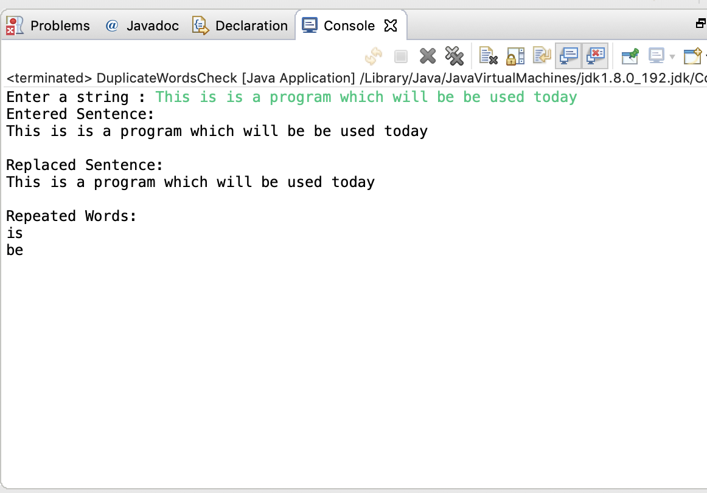

Validation of Credit Card Number using Regex.

Rules to validate

Visa : 13 or 16 digits, starting with 4.
MasterCard : 16 digits, starting with 51 through 55.
Discover : 16 digits, starting with 6011 or 65.
American Express : 15 digits, starting with 34 or 37.
Diners Club : 14 digits, starting with 300 through 305, 36, or 38.
JCB : 15 digits, starting with 2131 or 1800, or 16 digits starting with 35. 

